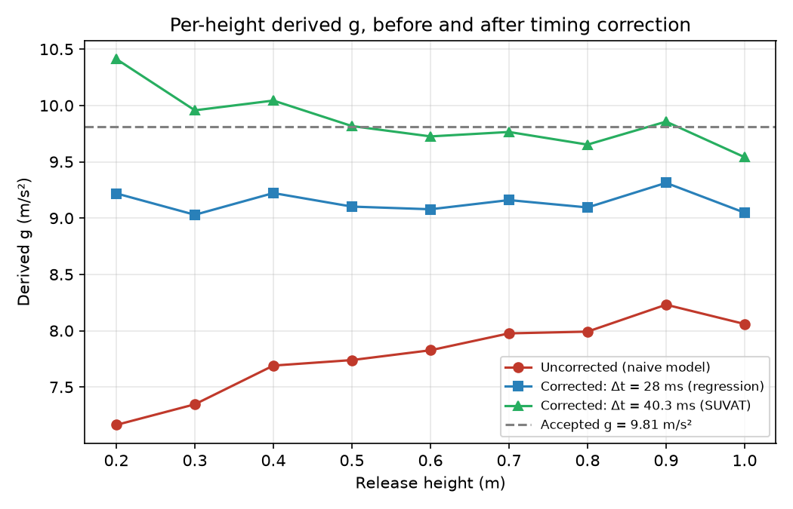

## Follow-up analysis: applying the timing correction

The original investigation's Improvements section proposed applying the identified timing correction directly and re-running the analysis. Done here, using the same raw data (no new hardware required).

**Method:** subtract each delay estimate from every measured average time (t_corrected = t − Δt), then recompute per-height g = 2x/t² and re-fit the naive t² vs x model.

**Results:**

| Correction applied | Regression g (m/s²) | vs 9.81 | Per-height g spread |
|---|---|---|---|
| None (original) | 8.46 | −13.8% | 7.16 → 8.23 (rises with height) |
| Δt = 28 ms (regression intercept) | 9.14 | −6.8% | 9.03 → 9.31 (flat, σ = 0.09) |
| Δt = 40.3 ms (SUVAT offset) | 9.48 | −3.4% | mean 9.86 ± 0.24 |

**What this shows:**

1. **The diagnosis is confirmed.** Uncorrected, derived g climbs systematically with height (7.16 → 8.23) — the fingerprint of a fixed additive delay. After the 28 ms correction, that trend vanishes: g is flat across all nine heights (σ = 0.09 m/s²). The height-dependence was entirely an artifact of the timing offset, as predicted.

2. **One honest caveat:** re-fitting after subtracting the regression's own intercept necessarily returns the same g (9.14) — that step is a self-consistency check, not new information. The genuinely new result is the flattening of the per-height values.

3. **A residual systematic error remains.** Even fully corrected by the data-derived delay, g = 9.14 sits 6.8% below 9.81 — larger than the statistical uncertainty (±0.16). The additive-delay model explains the height-dependence but not the entire gap. Remaining candidates: LDR detection lag that grows with impact speed, a small systematic height measurement bias, or the sphere receiving a slight push at release. Distinguishing these requires the hardware changes proposed in Improvements (release-point break-beam, servo feedback logging).
